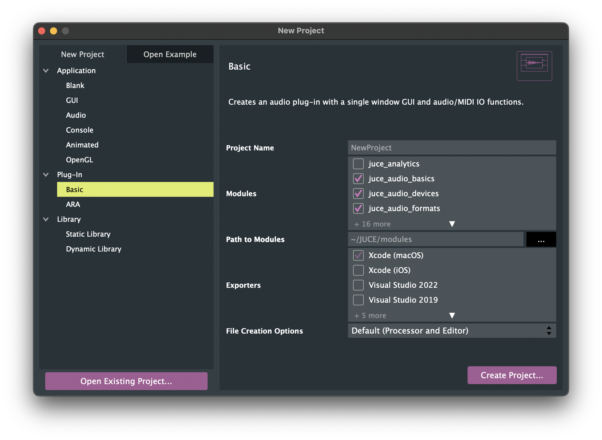
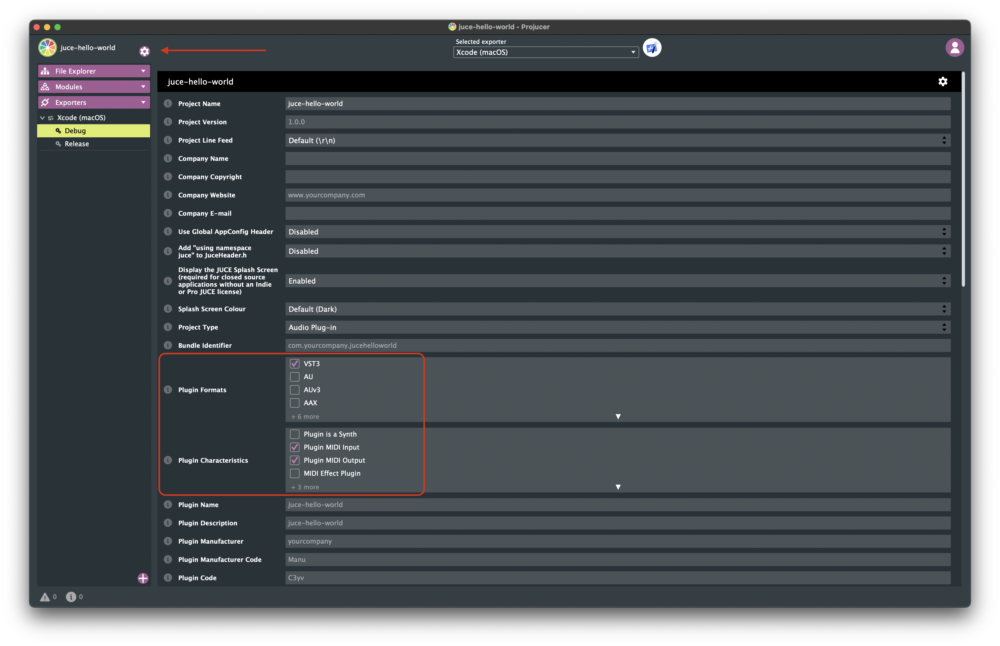
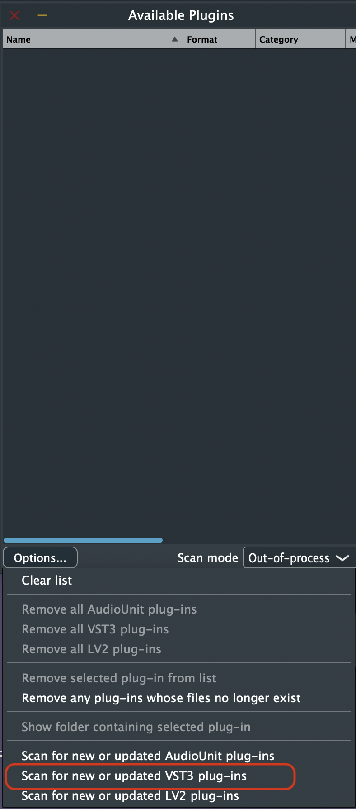
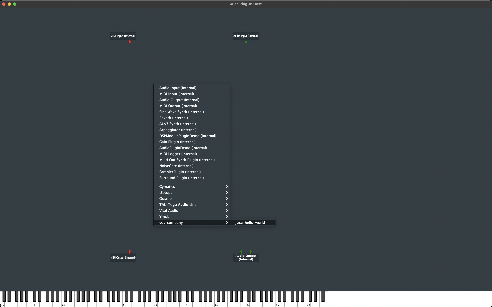
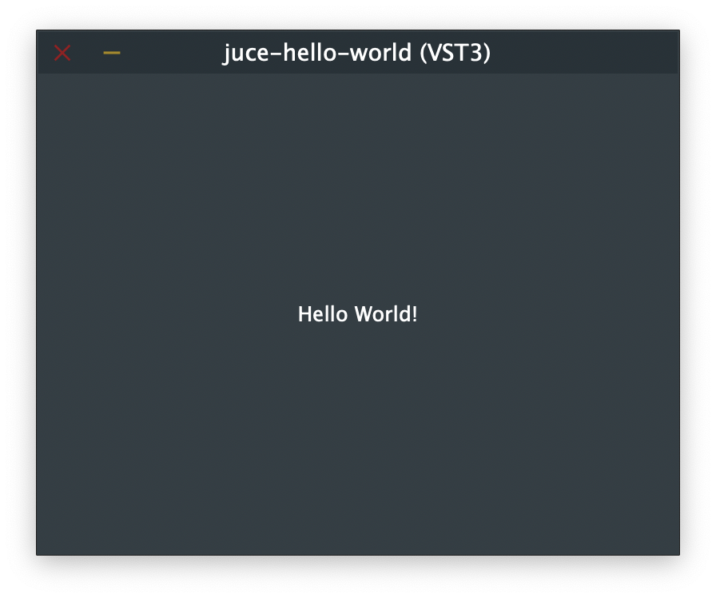

## setup

- download the JUCE and Projucer from [the official website](https://juce.com/download/)
  - unzip and copy the `JUCE` folder into `$HOME/` dir
- create a new project from Projucer with `Plugin - Basic`
  
- `ATTENTION` update the project settings to be able to build VST3 plugin
  

## build

- Save and open in IDE (Xcode for Mac)
- `cmd + b` to build the project
- the artifact `juce-hello-world.vst3` should be saved at the default path: `~/Library/Audio/Plug-Ins/VST3`

## debug

- open the AudioPluginHost project
  - `open ~/JUCE/extras/AudioPluginHost/AudioPluginHost.jucer`
- build it
- then you should be able to open the just build app
- `cmd + p` to open the plugin list
- `Options... - Scan for new and updated VST3 plug-ins` to scan the debug build
  
- load the debug plugin
  
  

## ref

- [Tutorial: Create a basic Audio/MIDI plugin, Part 1: Setting up](https://docs.juce.com/master/tutorial_create_projucer_basic_plugin.html)
